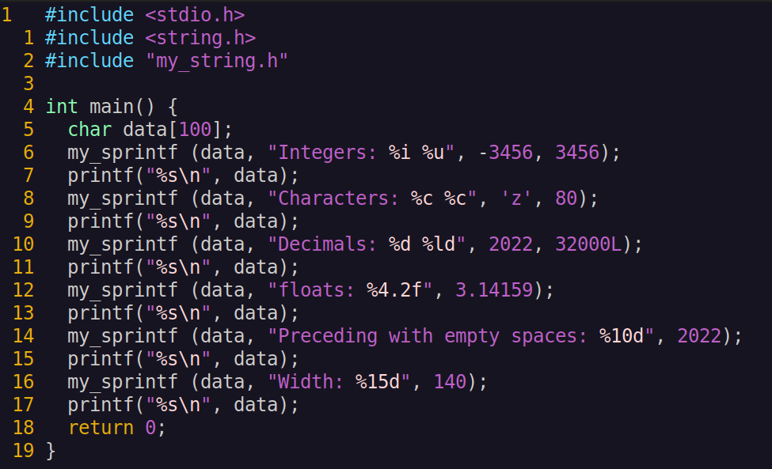

# __My sprintf (and some other functions from string.h)__

## __Description of project:__
__In this project I developed my own implementation of sprintf function with addition of some other functions from the string.h library.__

The library developed in accordance with the principles of structured programming as a static library (with the header file my_string.h) in C programming language of C11 standart.

I followed the logic of the standard string.h library (in terms of checks, working with memory and behavior in emergency situations).

Unit-tests check the results of my implementation by comparing them with the implementation of the standard string.h library

## __Description of my_sprintf:__

__int my_sprintf(char *str, const char *format, ...)__ - sends formatted output to a string pointed to, by str.

where:
- str − This is the C string that the function processes as its source to retrieve the data;
- format − This is the C string that contains one or more of the following items: Whitespace character, Non-whitespace character and Format specifiers. A format specifier for print functions follows this prototype: _"%[flags][width][.precision][length]specifier"_.

__The next partial formatting supported in my implementation:__

- Specifiers: c, d, i, f, s, u, %
- Flags: -, +, (space)
- Width description: (number)
- Precision description: .(number)
- Length description: h, l

### _my_sprintf Specifiers:_

| No. | Specifier | my_sprintf output |
| --- | --- | --- |
| 1 | c | Character |
| 2 | d | Signed decimal integer |
| 3 | i | Signed decimal integer |
| 4 | f | Decimal floating point |
| 5 | s | String of characters |
| 6 | u | Unsigned decimal integer |
| 7 | % | Character % |

### _my_sprintf Flags:_

| No. | Flags | Description |
| --- | --- | --- |
| 1 | - | Left-justify within the given field width; Right justification is the default (see width sub-specifier). |
| 2 | + | Forces to precede the result with a plus or minus sign (+ or -) even for positive numbers. By default, only negative numbers are preceded with a -ve sign. |
| 3 | (space) | If no sign is going to be written, a blank space is inserted before the value. |

### _my_sprintf Width Description:_

| No. |	Width | Description |
| --- | --- | --- |
| 1	| (number) | Minimum number of characters to be printed. If the value to be printed is shorter than this number, the result is padded with blank spaces. The value is not truncated even if the result is larger. |
| 2 | * | In sprintf the * sign means, that the width is not specified in the format string, but as an additional integer value argument preceding the argument that has to be formatted. In sscanf the * sign placed after % and before the format specifier reads data of the specified type, but suppresses their assignment. |

### _my_sprintf Precision Description:_

| No. |	.precision | Description |
| --- | --- | --- |
| 1	| .number | For integer specifiers (d, i, o, u, x, X) − precision specifies the minimum number of digits to be written. If the value to be written is shorter than this number, the result is padded with leading zeros. The value is not truncated even if the result is longer. A precision of 0 means that no character is written for the value 0. For e, E and f specifiers − this is the number of digits to be printed after the decimal point. For g and G specifiers − This is the maximum number of significant digits to be printed. For s − this is the maximum number of characters to be printed. By default all characters are printed until the ending null character is encountered. For c type − it has no effect. When no precision is specified for specifiers e, E, f, g and G, the default one is 6. When no precision is specified for all other kind of specifiers, the default is 1. If the period is specified without an explicit value for precision, 0 is assumed. |

### _my_sprintf Length Description:_

| No. |	Length | Description |
| --- | --- | --- |
| 1 | h | The argument is interpreted as a short int or unsigned short int (only applies to integer specifiers: i, d, u). |
| 2 | l | The argument is interpreted as a long int or unsigned long int for integer specifiers (i, d, u) |
| 3 | L | The argument is interpreted as a long double (only applies to floating point specifier − f). |

## __Description of functions from my_string.h:__
### _my_string.h Types_

| No. | Variable | Description |
| ------ | ------ | ------ |
| 1 | size_t | This is the unsigned integral type and is the result of the sizeof keyword. |
	
### _string.h Macro_

| No. | Macro | Description |
| ------ | ------ | ------ |
| 1 | NULL | This macro is the value of a null pointer constant. |

### _string.h Functions_

| No. | Function | Description |
| ------ | ------ | ------ |
| 1 | void *memchr(const void *str, int c, size_t n) | Searches for the first occurrence of the character c (an unsigned char) in the first n bytes of the string pointed to, by the argument str. |
| 2 | int memcmp(const void *str1, const void *str2, size_t n) | Compares the first n bytes of str1 and str2. |
| 3 | void *memcpy(void *dest, const void *src, size_t n) | Copies n characters from src to dest. |
| 4 | void *memmove(void *dest, const void *src, size_t n) | Another function to copy n characters from src to dest. |
| 5 | void *memset(void *str, int c, size_t n) | Copies the character c (an unsigned char) to the first n characters of the string pointed to, by the argument str. |
| 6 | char *strcat(char *dest, const char *src) | Appends the string pointed to, by src to the end of the string pointed to by dest. |
| 7 | char *strncat(char *dest, const char *src, size_t n) | Appends the string pointed to, by src to the end of the string pointed to, by dest up to n characters long. |
| 8	| char *strchr(const char *str, int c) | Searches for the first occurrence of the character c (an unsigned char) in the string pointed to, by the argument str. |
| 9 | int strcmp(const char *str1, const char *str2) | Compares the string pointed to, by str1 to the string pointed to by str2. |
| 10 | int strncmp(const char *str1, const char *str2, size_t n) | Compares at most the first n bytes of str1 and str2. |
| 11 | char *strcpy(char *dest, const char *src) | Copies the string pointed to, by src to dest. |
| 12 | char *strncpy(char *dest, const char *src, size_t n) | Copies up to n characters from the string pointed to, by src to dest. |
| 13 | size_t strcspn(const char *str1, const char *str2) | Calculates the length of the initial segment of str1 which consists entirely of characters not in str2. |
| 14 | size_t strlen(const char *str) | Computes the length of the string str up to but not including the terminating null character. |
| 15 | char *strpbrk(const char *str1, const char *str2) | Finds the first character in the string str1 that matches any character specified in str2. |
| 16 | char *strrchr(const char *str, int c) | Searches for the last occurrence of the character c (an unsigned char) in the string pointed to by the argument str. |
| 17 | size_t strspn(const char *str1, const char *str2) | Calculates the length of the initial segment of str1 which consists entirely of characters in str2. |
| 18 | char *strstr(const char *haystack, const char *needle) | Finds the first occurrence of the entire string needle (not including the terminating null character) which appears in the string haystack. |
| 19 | char *strtok(char *str, const char *delim) | Breaks string str into a series of tokens separated by delim. |

## __Compilation:__
Use make utility for building the library and tests.

Make targets:
 - my_string.a (get a static library)
 - sprintf_test (run unit-tests for sprintf)
 - string_test (run unit-tests for other string.h functions)
 - sprintf_report (generate a gcov report in the form of an html page)
 - string_report (generate a gcov report for other string.h functions)

## __Unit-tests and reports:__

## __Usage:__
Write some example code:

Compile code with library using gcc

